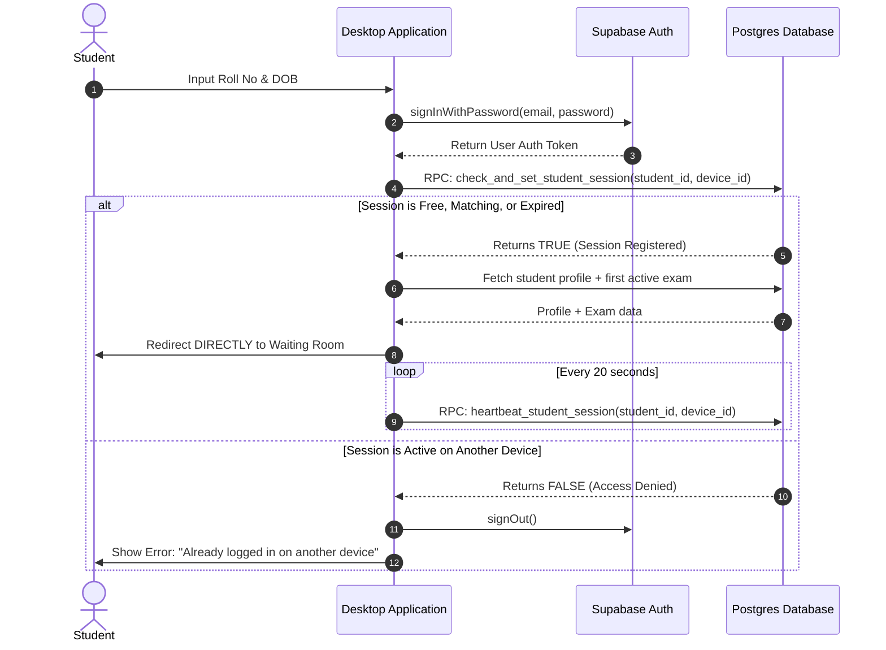

# Implementation Plan: Student Single-Session Login Enforcement

This plan details the implementation of a single-session lockout mechanism for student logins. Once a student successfully logs in on a device, they cannot log in on another device using the same credentials until their active session terminates or expires.

> [!NOTE]
> **Revision v1.2** — Changes from prior revisions:
> - **v1.1:** `FOR UPDATE` row lock added; `heartbeat_student_session` syntax fixed; Back button session clear added.
> - **v1.2:** Exam Selection step removed. After login, the app auto-selects the first active exam and redirects **directly to the Waiting Room**. The Back button concern is no longer relevant and has been removed from Phase D.

---

## 1. Core Architecture Design

We utilize a hybrid database-and-client approach to track student sessions securely and dynamically:
1. **Device ID Identification**: Every device running the desktop app generates and persists a unique client-side UUID (`device_id`). This allows a student to bypass lockout and instantly log back in if their app restarts or crashes on the same machine.
2. **Dynamic Heartbeats**: While logged in, the application sends a periodic background heartbeat updating the student's database session.
3. **Session Auto-Expiration**: If a device goes offline or crashes without cleanly clearing the session, the session will automatically be considered expired after 60 seconds of heartbeat inactivity.
4. **Secure Execution**: We implement database functions with `SECURITY DEFINER` so that student clients can safely register, update, and clear their session metadata without needing broad `UPDATE` privileges on the `students` table.



---

## 2. Database Migration

The following SQL updates must be executed in the Supabase Dashboard SQL Editor or appended to your migrations.

```sql
-- ============================================================
-- 1. Schema Extensions
-- ============================================================

-- Add session tracking columns directly to public.students
ALTER TABLE public.students ADD COLUMN IF NOT EXISTS active_device_id TEXT;
ALTER TABLE public.students ADD COLUMN IF NOT EXISTS last_active_at TIMESTAMP WITH TIME ZONE;

-- ============================================================
-- 2. RPC Functions
-- ============================================================

-- A. check_and_set_student_session
-- Checks if session is free/expired, and registers the current device if available.
CREATE OR REPLACE FUNCTION public.check_and_set_student_session(
    p_student_id UUID,
    p_device_id TEXT
)
RETURNS BOOLEAN AS $$
DECLARE
    v_active_device_id TEXT;
    v_last_active_at TIMESTAMP WITH TIME ZONE;
    v_now TIMESTAMP WITH TIME ZONE;
BEGIN
    v_now := NOW();
    
    SELECT active_device_id, last_active_at 
    INTO v_active_device_id, v_last_active_at
    FROM public.students
    WHERE id = p_student_id
    FOR UPDATE; -- Atomic row lock: prevents two devices from passing the check simultaneously
    
    -- Session is claimable if:
    -- 1. No active device is recorded.
    -- 2. The recorded device matches the incoming device ID (re-log/re-connection).
    -- 3. The last activity was more than 60 seconds ago (heartbeat timeout).
    IF v_active_device_id IS NULL 
       OR v_active_device_id = p_device_id 
       OR v_last_active_at IS NULL 
       OR v_last_active_at < (v_now - INTERVAL '60 seconds') THEN
       
        UPDATE public.students
        SET active_device_id = p_device_id,
            last_active_at = v_now
        WHERE id = p_student_id;
        
        RETURN TRUE;
    ELSE
        RETURN FALSE;
    END IF;
END;
$$ LANGUAGE plpgsql SECURITY DEFINER;

-- B. clear_student_session
-- Clears the session credentials upon logout, exit, or exam submission.
CREATE OR REPLACE FUNCTION public.clear_student_session(
    p_student_id UUID,
    p_device_id TEXT
)
RETURNS VOID AS $$
BEGIN
    UPDATE public.students
    SET active_device_id = NULL,
        last_active_at = NULL
    WHERE id = p_student_id AND (active_device_id = p_device_id OR active_device_id IS NULL);
END;
$$ LANGUAGE plpgsql SECURITY DEFINER;

-- C. heartbeat_student_session
-- Updates the activity timestamp to keep the session alive.
CREATE OR REPLACE FUNCTION public.heartbeat_student_session(
    p_student_id UUID,
    p_device_id TEXT
)
RETURNS BOOLEAN AS $$
DECLARE
    v_active_device_id TEXT;  -- DECLARE block must not contain END;
BEGIN
    SELECT active_device_id INTO v_active_device_id
    FROM public.students
    WHERE id = p_student_id;

    -- Only update if the session is still owned by the current device
    IF v_active_device_id = p_device_id THEN
        UPDATE public.students
        SET last_active_at = NOW()
        WHERE id = p_student_id;
        RETURN TRUE;
    ELSE
        RETURN FALSE;
    END IF;
END;
$$ LANGUAGE plpgsql SECURITY DEFINER;
```

---

## 3. Desktop Application Changes

### Phase A: Device ID Generation
Create a helper function in a new utility or inline inside `App.tsx` / `Login.tsx`:

```typescript
export const getDeviceId = (): string => {
  let devId = localStorage.getItem('examos_device_id');
  if (!devId) {
    // Basic fallback UUID generator
    devId = window.crypto?.randomUUID?.() || Math.random().toString(36).substring(2) + Date.now().toString(36);
    localStorage.setItem('examos_device_id', devId);
  }
  return devId;
};
```

### Phase B: Reworking `handleStudentAuth` in [Login.tsx](file:///c:/Users/91863/Desktop/GrowTez_projects/ExamOS/growtez-examos/apps/desktop-app/src/components/Login.tsx)

The login flow is collapsed into a **single step**. On successful credential check the app:
1. Checks the device session lock.
2. Fetches the student profile.
3. Auto-selects the **first active exam**.
4. Calls `onLoginSuccess(profile, exam, 'waiting_room')` to jump directly to the Waiting Room.

The following state variables and functions become **dead code and must be deleted**:
- `authSuccess` state
- `assignedExams` state
- `selectedExamId` state
- `handleStartExam` function
- The entire Exam Selection Form JSX block (`authSuccess === true` branch)

```diff
       if (authError) throw authError;
       if (!authData || !authData.user) throw new Error('Authentication failed: user not found');
 
+      // 1. Check and lock the device session
+      const devId = getDeviceId();
+      const { data: isSessionValid, error: sessionError } = await supabase.rpc(
+        'check_and_set_student_session',
+        { p_student_id: authData.user.id, p_device_id: devId }
+      );
+      if (sessionError || !isSessionValid) {
+        throw new Error('This student is already logged in on another device.');
+      }
+
       // Fetch student profile details
       const { data: profile, error: profileError } = await supabase
         .from('students')
         .select('*')
         .eq('id', authData.user.id)
         .single();
 
       if (profileError || !profile) {
         throw new Error('Student profile not found. Please contact school admin.');
       }
 
-      // Fetch exams assigned to this student
-      const { data: examAssignments, error: examError } = await supabase
+      // 2. Auto-select the first active exam — no exam selection UI needed
+      const { data: examAssignments, error: examError } = await supabase
         .from('exam_students')
         .select('*, exams:exam_id(*)')
         .eq('student_id', authData.user.id)
         .eq('status', 'assigned');
 
       if (examError) throw examError;
 
       const activeExams = (examAssignments || [])
         .map((a: any) => a.exams)
         .filter((e: any) => e && (e.status === 'published' || e.status === 'active'));
 
       if (activeExams.length === 0) {
         throw new Error('No active exams assigned to you at this moment.');
       }
 
-      setAssignedExams(activeExams);
-      setSelectedExamId(activeExams[0].id);
-      setAuthSuccess(true);
+      // 3. Directly redirect to Waiting Room with first active exam
+      onLoginSuccess(profile, activeExams[0], 'waiting_room');
```

> [!WARNING]
> If `onLoginSuccess` is called inside the `try` block, make sure the `catch` block still calls `supabase.auth.signOut()` AND `clear_student_session` — since the session was already locked before the redirect.

### Phase C: Implementing Keep-Alive Heartbeat in [App.tsx](file:///c:/Users/91863/Desktop/GrowTez_projects/ExamOS/growtez-examos/apps/desktop-app/src/App.tsx)
Ensure the session is refreshed every 20 seconds using a background effect inside `App.tsx`:

```typescript
useEffect(() => {
  if (!studentProfile?.id || step === 'login' || step === 'submitted') return;

  const devId = getDeviceId();
  
  // Set up periodic heartbeat
  const interval = setInterval(async () => {
    try {
      const { data: isSuccess, error } = await supabase.rpc('heartbeat_student_session', {
        p_student_id: studentProfile.id,
        p_device_id: devId
      });
      
      if (error || !isSuccess) {
        console.warn('Heartbeat failed, device session taken over or expired.');
      }
    } catch (e) {
      console.error('Failed to send heartbeat', e);
    }
  }, 20000); // 20 seconds interval

  return () => clearInterval(interval);
}, [studentProfile, step]);
```

### Phase D: Graceful Session Release
Ensure we invoke `clear_student_session` RPC on cleanup events:
1. **Closing App** (both in `App.tsx` and `Login.tsx`):
   ```typescript
   const handleCloseApp = async () => {
     try {
       if (studentProfile?.id) {
         await supabase.rpc('clear_student_session', {
           p_student_id: studentProfile.id,
           p_device_id: getDeviceId()
         });
       }
       const { appWindow } = await import('@tauri-apps/api/window');
       await appWindow.close();
     } catch (e) {
       console.error('[KioskMode] Failed to close application window.', e);
     }
   };
   ```
2. **Exam Submission** in `ExamInterface.tsx` (both manual and auto-submit):
   ```typescript
   await supabase.rpc('clear_student_session', {
     p_student_id: studentProfile.id,
     p_device_id: getDeviceId()
   });
   await supabase.auth.signOut();
   ```

---

> [!IMPORTANT]
> The database migration (Step 2) must be applied to the database before testing client changes, as the client relies directly on the new columns and RPCs.
